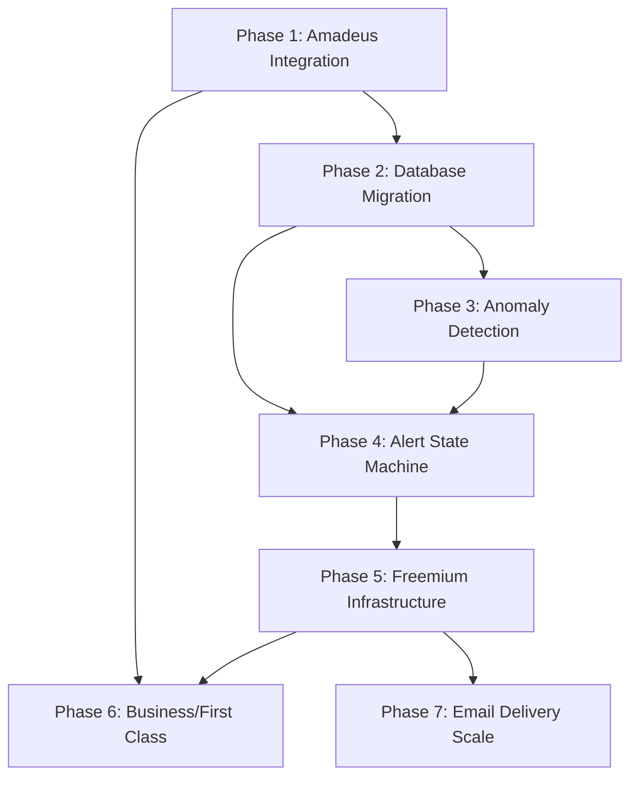

# Roadmap: Detty Flight Deals

**Project:** Flight deal monitoring service for the African diaspora
**Milestone:** Beta Launch (200 subscribers, 3-month beta, then freemium at $5/month)
**Depth:** Standard (7 phases)
**Last Updated:** 2026-02-11

---

## Overview

Transform the working MVP from daily-only monitoring with JSON files into a production-grade freemium service. The competitive advantage is **focus** - continuous monitoring of 77+ Africa routes that general-purpose services (Going, Secret Flying) only check sporadically. Each phase is independently valuable; stopping after any phase leaves the system better than before.

**Key evolution:** Stateless scripts → Multi-frequency pipeline with database persistence, tier-escalation alerts, and subscriber segmentation. All serverless on GitHub Actions.

---

## Milestone 1: Beta Launch

### Phase 1: Amadeus Integration

**Goal:** Beat competitors on speed by monitoring 6 priority routes every 2 hours instead of daily.

**Plans:** 3 plans

Plans:
- [x] 01-01-PLAN.md — Amadeus SDK client + price tracker (data layer)
- [x] 01-02-PLAN.md — Cross-validator + monitor coordinator (logic layer)
- [x] 01-03-PLAN.md — GitHub Actions workflow + integration verification (deployment layer)

**Requirements Covered:**
- DISC-01: Monitor 6 priority routes every 2 hours via Amadeus Cheapest Date Search
- DISC-02: Cross-validate Amadeus prices against Google Flights before alerting
- DISC-03: Scan full date ranges (not sample weeks) for priority routes

**Key Deliverables:**
- `amadeus_client.py` - OAuth2 authentication + Cheapest Date Search API wrapper
- `price_tracker.py` - Price change detection and caching logic
- `cross_validator.py` - Cross-validate Amadeus prices against Google Flights
- `amadeus_monitor.py` - Priority route monitoring coordinator
- `.github/workflows/priority_monitor.yml` - GitHub Actions workflow running every 2 hours

**Dependencies:**
- Amadeus API credentials (signup at developers.amadeus.com)
- Existing MVP codebase (fast-flights daily monitoring)
- GitHub Actions secrets: `AMADEUS_CLIENT_ID`, `AMADEUS_CLIENT_SECRET`

**Estimated Cost Impact:**
- **+$0-15/month** (Amadeus free tier: 2,000 calls/month covers 6 routes at 12 checks/day = 2,160 calls/month)
- May need paid tier if expanding priority routes beyond 6

**Success Criteria:**
1. Priority routes (JFK-LOS, EWR-ACC, ATL-LOS, IAD-ACC, DFW-LOS, IAH-ACC) checked every 2 hours
2. API call count stays under 2,160/month (tracked via Amadeus dashboard)
3. Zero alerts sent on Amadeus-only data (all deals cross-validated against fast-flights)
4. Cheapest Date Search returns full year of prices in single API call (not 26 separate calls)
5. System integrates alongside existing daily fast-flights monitoring (no replacement)

**Notes:**
- Amadeus Self-Service excludes Delta, American Airlines, British Airways, all LCCs - keep fast-flights as primary data source
- Cross-validation prevents false alerts from ghost fares or cache staleness

---

### Phase 2: Database Migration

**Goal:** Replace JSON files with queryable database to enable historical analysis and eliminate git merge conflicts.

**Plans:** 3 plans

Plans:
- [x] 02-01-PLAN.md — Database client + schema setup (db package with TursoClient)
- [x] 02-02-PLAN.md — Dual-write integration (price_tracker + deal_finder)
- [x] 02-03-PLAN.md — GitHub Actions + validation (workflow secrets + validation script)

**Requirements Covered:**
- DATA-01: Store all price observations in Turso database with append-only history
- DATA-02: Replace seen_deals.json with price_cache materialized view
- DATA-03: Create alert_state table for FSM state tracking per route
- DATA-04: Dual-write migration (JSON + Turso for 1 week validation)
- DATA-05: Graceful degradation - fall back to JSON if Turso unreachable

**Key Deliverables:**
- Turso database setup (5GB free tier)
- `db/client.py` - Database client with connection handling, retries, fallback logic
- Schema migration:
  - `price_observations` table (id, route, date_checked, price, source, tier, cabin_class)
  - `price_cache` table (current route states, replaces seen_deals.json)
  - `alert_state` table (route, current_tier, cooldown_expiry, reset_counter)
- Dual-write integration - price_tracker.py and deal_finder.py write to both JSON and Turso
- Validation script - compare JSON vs Turso state for consistency

**Dependencies:**
- Phase 1 complete (validates multiple write sources work together)
- Turso account and database URL
- GitHub Actions secret: `TURSO_DATABASE_URL`, `TURSO_AUTH_TOKEN`

**Estimated Cost Impact:**
- **+$0-5/month** (Turso free tier: 500M reads, 10M writes, 5GB storage - likely sufficient through beta)

**Success Criteria:**
1. All price observations from Amadeus and fast-flights stored in price_observations table
2. price_cache table returns current route states in <100ms (replaces seen_deals.json lookups)
3. alert_state table persists FSM state across workflow runs
4. No git commits of seen_deals.json or price_history.jsonl after Phase 2 complete
5. Zero data loss during migration (dual-write comparison validates consistency)
6. System falls back to JSON if Turso connection fails (graceful degradation tested)
7. Historical queries work: "SELECT last 90 days for JFK-LOS" returns results

**Notes:**
- Dual-write period: 1 week minimum to validate data consistency
- Turso is libSQL (SQLite-compatible) accessed via HTTPS - no persistent connections needed

---

### Phase 3: Anomaly Detection

**Goal:** Replace manual percentage thresholds with data-driven baselines to discover exceptional deals.

**Plans:** 3 plans

Plans:
- [x] 03-01-PLAN.md — Anomaly module foundation (AnomalyDetector, SeasonalAdjuster, static thresholds)
- [x] 03-02-PLAN.md — Level shift detection + database price history query
- [x] 03-03-PLAN.md — BaselineCalculator integration into deal_finder.py

**Requirements Covered:**
- DISC-04: Detect anomalously cheap fares via rolling z-score (z < -2.5)
- DISC-05: Discover own mistake fares via level shift detection
- DISC-06: Fall back to static thresholds when <30 observations exist
- DISC-07: Apply seasonal adjustments (Dec-Jan +50%, Jun-Aug +25%)

**Key Deliverables:**
- `anomaly/anomaly_detector.py` - Rolling z-score calculations using scipy/numpy/pandas
- `anomaly/baseline_calculator.py` - Hybrid classification combining z-score, level shift, and static fallbacks
- `anomaly/level_shift_detector.py` - Custom pandas-based level shift detection (sudden 40%+ drops)
- `anomaly/seasonal_adjustments.py` - Apply threshold multipliers by month
- `anomaly/static_thresholds.py` - Cold-start fallback thresholds from pm-docs research
- Hybrid baseline logic:
  - Use z-score when 30+ observations exist for route
  - Fall back to static thresholds otherwise
  - 2-week silent monitoring for new routes
- Integration into deal_finder.py

**Dependencies:**
- Phase 2 complete (needs queryable price history)
- Python packages: scipy, numpy, pandas
- Historical data: 30+ observations per route (will accumulate over time)

**Estimated Cost Impact:**
- **+$0/month** (compute-only, runs in GitHub Actions free tier)

**Success Criteria:**
1. Routes with 30+ observations use z-score baselines instead of static percentages
2. New routes (<30 observations) fall back to static thresholds gracefully
3. Level shift detector flags sudden 40%+ price drops as exceptional deals
4. Seasonal adjustments prevent false positives during Detty December (Dec-Jan)
5. Z-score < -2.5 threshold identifies bottom ~0.6% of price distribution
6. Classification method tracked in deal metadata for observability

**Notes:**
- Initial months will use mostly static thresholds while collecting data
- Seasonal adjustments critical before December 2026 to avoid alert fatigue
- Custom level shift detection replaces ADTK (unmaintained since 2020)

---

### Phase 4: Alert State Machine

**Goal:** Eliminate alert fatigue by only notifying on tier transitions, not minor price wiggles.

**Plans:** 2 plans

Plans:
- [x] 04-01-PLAN.md — FSM core (AlertState Enum, AlertStateMachine class, database schema extension)
- [x] 04-02-PLAN.md — Email templates + deal_finder integration

**Requirements Covered:**
- ALRT-01: Alert only on tier transitions (Great->WOW), not same-tier fluctuations
- ALRT-02: "Once per deal window" cooldown (alert once when deal appears at a tier)
- ALRT-03: Tier escalation overrides cooldown (Great->WOW alerts immediately)
- ALRT-04: Reset alert cycle when price returns to normal for 3 consecutive checks
- ALRT-05: Persist FSM state per route in alert_state table

**Key Deliverables:**
- `alert/state_machine.py` - Tier-escalation finite state machine with 5 states
- `alert/templates.py` - Email formatting helpers for tier labels and escalation context
- FSM states: NORMAL -> GREAT_ALERTING -> GREAT_ALERTED -> WOW_ALERTING -> WOW_ALERTED
- Database schema extension: `last_alert_tier` and `last_alert_price_cents` columns
- Integration into deal_finder.py replacing is_new_deal() logic
- Tier emojis: * for Great, ** for WOW, !! for Mistake fares

**Dependencies:**
- Phase 2 complete (needs alert_state table)
- Phase 3 complete (needs tier classification from anomaly detector)

**Estimated Cost Impact:**
- **+$0/month** (compute-only)

**Success Criteria:**
1. No re-alerts for same-tier price wiggles (e.g., JFK-LOS stays at $650 Great, no repeated alerts)
2. Tier escalations (Great->WOW) fire immediately with is_escalation=True
3. Price return to normal for 3 consecutive checks resets alert cycle correctly
4. De-escalation (WOW->Great) is silent (no alert)
5. alert_state table correctly persists FSM state across workflow runs
6. Email subjects include tier emoji (* Great, ** WOW, !! MISTAKE)

**Notes:**
- Two tiers only: Great (free users) and WOW (premium) - no "Good" tier
- Mistake fares are flagged separately and always route to premium
- De-escalation is silent by design (only alert on good news)

---

### Phase 5: Freemium Infrastructure

**Goal:** Enable subscriber segmentation and regional personalization to support freemium conversion.

**Plans:** 5 plans

Plans:
- [x] 05-01-PLAN.md — Database schema (subscribers + digest_queue) + metro groups + TursoClient CRUD
- [x] 05-02-PLAN.md — SubscriberManager + Google Sheets migration + trial management
- [x] 05-03-PLAN.md — AlertRouter + SMS sender + deal_finder integration
- [x] 05-04-PLAN.md — Weekly digest generation + FOMO teasers + email templates
- [x] 05-05-PLAN.md — Weekly digest workflow + payment reminders + verification

**Requirements Covered:**
- SUBS-01: Store subscribers in database with tier and preference fields
- SUBS-02: Each subscriber has tier (free/premium) and regional preferences
- SUBS-03: Free tier gets weekly digest of Great economy deals (region-filtered, 1 metro)
- SUBS-04: Premium tier gets instant WOW alerts, mistake fares, SMS for mistake fares, historical price context
- SUBS-05: Support 200+ subscribers without delivery failures
- FRML-01: Expired deal teasers in weekly digest — 2-3 WOW/mistake fares at random, urgency tone
- FRML-02: Premium subscribers set unlimited origin metro preferences
- FRML-03: Premium subscribers set regional destination preferences (West, East, North, Southern Africa)
- FRML-04: 1-week free trial for new subscribers

**Key Deliverables:**
- `subscriber/` package: manager.py, router.py, digest.py, trial.py, metro_groups.py, migration.py, sms.py, reminders.py
- Extended db/schema.py with subscribers + digest_queue tables
- Extended db/client.py with subscriber CRUD + digest queue methods
- Extended alert/templates.py with weekly digest HTML template + FOMO teasers
- Updated deal_finder.py with AlertRouter tier-based routing
- `.github/workflows/weekly_digest.yml` - Sunday morning cron for free tier digest + payment reminders

**Dependencies:**
- Phase 2 complete (Turso database available)
- Phase 4 complete (tier classification and FSM working)

**Estimated Cost Impact:**
- **+$0-5/month** (Twilio toll-free: $2.15/month + $0.0083/SMS; Gmail SMTP still free until Phase 7)

**Success Criteria:**
1. subscribers table has tier field (free/premium/trial) and metro/regional preference fields
2. Free subscribers receive weekly digest with metro-filtered Great deals only
3. Premium subscribers receive instant WOW alerts, mistake fares, and instant Great deals
4. Metro preferences filter alerts correctly (NYC subscriber doesn't get ATL-LOS deals)
5. 2-3 FOMO teasers embedded in weekly digest with urgency tone
6. 1-week trial tracked correctly, auto-expires premium features after 7 days
7. SMS sent for mistake fares to premium subscribers with phone numbers
8. 200+ subscribers receive emails without failures (Gmail 90/day safety limit)
9. Google Sheets subscribers migrated to Turso idempotently

**Notes:**
- Metro groups: NYC (JFK+EWR), DC (IAD), ATL, HOU (IAH), CHI (ORD), LA (LAX), DFW, BOS
- Payment: $15/quarter via manual Venmo/Zelle, automated email reminders
- Legacy send_email() preserved as fallback during migration period
- Gmail 100/day limit constraining until Phase 7 (Resend migration)

---

### Phase 6: Business/First Class Monitoring

**Goal:** Add premium differentiator by monitoring business/first class fares (Going charges $199/year for this).

**Plans:** 3 plans

Plans:
- [ ] 06-01-PLAN.md — Amadeus cabin class parameter + premium static thresholds + API budget tracker + cabin-aware cache keys
- [ ] 06-02-PLAN.md — PremiumCabinMonitor orchestrator + BaselineCalculator premium path + silent monitoring enforcement
- [ ] 06-03-PLAN.md — Premium cabin email templates + GitHub Actions workflow (5-hour cadence)

**Requirements Covered:**
- BUSN-01: Monitor business/first class fares on priority routes via Amadeus cabin class parameter
- BUSN-02: Apply separate thresholds for business class (40-50% below baseline)
- BUSN-03: Route business/first class deals only to premium subscribers

**Key Deliverables:**
- `travelClass` parameter added to Amadeus Flight Offers Search (ECONOMY, BUSINESS, FIRST, PREMIUM_ECONOMY)
- Premium cabin static thresholds + BaselineCalculator premium path
- API budget tracker with $25/month hard cap and monthly rollover
- Premium cabin monitor orchestrator with 28-day silent monitoring period
- Premium-only routing via existing AlertRouter
- Cabin-class-aware email templates (subject + body)
- GitHub Actions workflow (every 5 hours, separate from economy)

**Dependencies:**
- Phase 1 complete (Amadeus API supports cabin class parameter)
- Phase 5 complete (premium subscriber routing works)

**Estimated Cost Impact:**
- **+$5-10/month** (additional Amadeus API calls for business/first class queries)

**Success Criteria:**
1. Business/first class fares monitored on 6 priority routes (JFK-LOS, EWR-ACC, ATL-LOS, IAD-ACC, DFW-LOS, IAH-ACC)
2. Business class deals found 2-4x/month on priority routes
3. Business class thresholds applied correctly (40-50% below baseline vs. 30% for economy)
4. Only premium subscribers receive business/first class alerts
5. Email alerts clearly distinguish cabin class (subject line, header, pricing display)

**Notes:**
- Business class is different product with different buyers - premium pricing justified
- Validate diaspora demand for business class before expanding beyond priority routes

---

### Phase 7: Email Delivery Scale

**Goal:** Scale beyond 100 subscribers and comply with Gmail/Yahoo 2025 email requirements.

**Requirements Covered:**
- MAIL-01: Replace Gmail SMTP with transactional email service (Resend/SendGrid)
- MAIL-02: Configure SPF/DKIM/DMARC for sending domain
- MAIL-03: Implement one-click unsubscribe via List-Unsubscribe header
- MAIL-04: Achieve >95% delivery rate, <0.1% spam complaint rate

**Key Deliverables:**
- Resend integration replacing Gmail SMTP
- `email_client.py` - Resend SDK wrapper with retry logic
- DNS configuration:
  - SPF record: `v=spf1 include:resend.com ~all`
  - DKIM record: Provided by Resend
  - DMARC record: `v=DMARC1; p=quarantine; rua=mailto:dmarc@dettyflightdeals.com`
- List-Unsubscribe header - one-click unsubscribe compliance (Gmail/Yahoo requirement)
- Delivery analytics dashboard - track open rates, bounce rates, spam complaints
- Unsubscribe handler - process List-Unsubscribe POST requests, update subscribers table

**Dependencies:**
- Phase 5 complete (subscriber count approaching 100)
- Domain ownership: dettyflightdeals.com (or similar)
- DNS access for SPF/DKIM/DMARC configuration

**Estimated Cost Impact:**
- **+$0-20/month** (Resend: 3,000 emails free/month, then $20/50,000)
- At 200 subscribers x 4 emails/month = 800 emails (free tier)
- At 500 subscribers x 4 emails/month = 2,000 emails (free tier)
- At 1,000 subscribers x 4 emails/month = 4,000 emails (paid tier)

**Success Criteria:**
1. Send to 200+ subscribers without failures (current Gmail SMTP caps at 100/day)
2. Deliverability rate >95% (tracked via Resend analytics)
3. Spam complaint rate <0.1% (industry standard for transactional email)
4. One-click unsubscribe works correctly (List-Unsubscribe header processed by Gmail/Yahoo)
5. SPF/DKIM/DMARC configured and passing (verified via mail-tester.com)
6. Bounce handling implemented (hard bounces remove from subscribers table)

**Notes:**
- **CRITICAL:** Switch email delivery before subscriber count reaches 50 (Gmail hard limit is 100/day)
- This phase may need to be pulled earlier if subscriber growth exceeds expectations
- Current mailto: unsubscribe is non-compliant with Gmail/Yahoo 2025 requirements

---

## Phase Dependencies

**Critical path:** 1 -> 2 -> 3 -> 4 -> 5 -> 7

**Parallel opportunities:**
- Phase 6 can start after Phase 5 (independent feature)
- Phase 7 must start when subscriber count approaches 50 (may interrupt other phases)

---

## Cost Trajectory

| After Phase | Monthly Cost | Capabilities |
|-------------|--------------|--------------|
| **MVP (current)** | $0 | Daily monitoring, 77 routes, <100 subscribers, Gmail SMTP |
| **Phase 1-2** | $0-20 | + 2-hour priority monitoring, database persistence |
| **Phase 3-4** | $0-20 | + Own mistake fare detection, tier-escalation alerts |
| **Phase 5** | $0-25 | + Freemium segmentation, regional preferences, up to 750 subscribers |
| **Phase 6** | $5-35 | + Business/first class deals (premium differentiator) |
| **Phase 7** | $5-45 | + Scale to 1,000+ subscribers, Gmail compliance, delivery analytics |

**Budget target:** $50-100/month (well within range through Phase 7 and beyond)

---

## Coverage Validation

### Requirements Mapped by Phase

| Phase | Requirements | Count |
|-------|--------------|-------|
| Phase 1: Amadeus Integration | DISC-01, DISC-02, DISC-03 | 3 |
| Phase 2: Database Migration | DATA-01, DATA-02, DATA-03, DATA-04, DATA-05 | 5 |
| Phase 3: Anomaly Detection | DISC-04, DISC-05, DISC-06, DISC-07 | 4 |
| Phase 4: Alert State Machine | ALRT-01, ALRT-02, ALRT-03, ALRT-04, ALRT-05 | 5 |
| Phase 5: Freemium Infrastructure | SUBS-01, SUBS-02, SUBS-03, SUBS-04, SUBS-05, FRML-01, FRML-02, FRML-03, FRML-04 | 9 |
| Phase 6: Business/First Class | BUSN-01, BUSN-02, BUSN-03 | 3 |
| Phase 7: Email Delivery Scale | MAIL-01, MAIL-02, MAIL-03, MAIL-04 | 4 |

**Total requirements:** 33
**Mapped requirements:** 33
**Orphaned requirements:** 0

### Coverage Verification

All v1 requirements from REQUIREMENTS.md are mapped to exactly one phase. No gaps, no duplicates.

---

## Progress Tracking

| Phase | Status | Started | Completed | Notes |
|-------|--------|---------|-----------|-------|
| 1 - Amadeus Integration | **Complete** | 2026-01-27 | 2026-01-28 | 3 plans, 3 waves, verified |
| 2 - Database Migration | **Complete** | 2026-01-28 | 2026-01-28 | 3 plans, 3 waves, verified |
| 3 - Anomaly Detection | **Complete** | 2026-01-28 | 2026-01-28 | 3 plans, 2 waves, verified |
| 4 - Alert State Machine | **Complete** | 2026-02-10 | 2026-02-10 | 2 plans, 2 waves, verified |
| 5 - Freemium Infrastructure | **Complete** | 2026-02-10 | 2026-02-10 | 5 plans, 4 waves, verified (9/9 must-haves) |
| 6 - Business/First Class | **Complete** | 2026-02-11 | 2026-02-11 | 3 plans, 3 waves, verified (18/18 must-haves) |
| 7 - Email Delivery Scale | Pending | — | — | **MUST start when subscribers approach 50** |

---

## Next Steps

**Immediate:** Plan and execute Phase 7 (Email Delivery Scale)
- Run: `/gsd:discuss-phase 7` or `/gsd:plan-phase 7`
- **CRITICAL:** Must complete before subscriber count reaches 50 (Gmail SMTP hard limit = 100/day)
- Depends on: Phase 5 (subscriber infrastructure) -- complete

**Credentials needed (if not done):**
1. Amadeus secrets: `gh secret set AMADEUS_CLIENT_ID` and `gh secret set AMADEUS_CLIENT_SECRET`
2. Turso secrets: `gh secret set TURSO_DATABASE_URL` and `gh secret set TURSO_AUTH_TOKEN`
3. Twilio secrets: `gh secret set TWILIO_ACCOUNT_SID`, `gh secret set TWILIO_AUTH_TOKEN`, `gh secret set TWILIO_FROM_NUMBER`

---

*Roadmap created: 2026-01-27*
*Phase 1 planned: 2026-01-27*
*Phase 1 complete: 2026-01-28*
*Phase 2 planned: 2026-01-28*
*Phase 2 complete: 2026-01-28*
*Phase 3 planned: 2026-01-28*
*Phase 3 complete: 2026-01-28*
*Phase 4 planned: 2026-01-28*
*Phase 4 complete: 2026-02-10*
*Phase 5 planned: 2026-02-10*
*Phase 5 complete: 2026-02-10*
*Phase 6 planned: 2026-02-10*
*Phase 6 complete: 2026-02-11*
*Next review: After Phase 7 planning*
