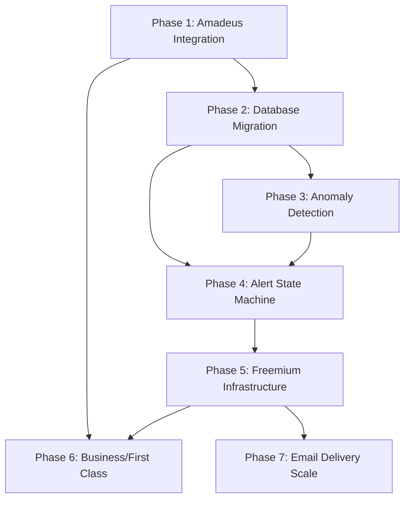

# Roadmap: Detty Flight Deals

**Project:** Flight deal monitoring service for the African diaspora
**Milestone:** Beta Launch (200 subscribers, 3-month beta, then freemium at $5/month)
**Depth:** Standard (7 phases)
**Last Updated:** 2026-01-27

---

## Overview

Transform the working MVP from daily-only monitoring with JSON files into a production-grade freemium service. The competitive advantage is **focus** - continuous monitoring of 77+ Africa routes that general-purpose services (Going, Secret Flying) only check sporadically. Each phase is independently valuable; stopping after any phase leaves the system better than before.

**Key evolution:** Stateless scripts → Multi-frequency pipeline with database persistence, tier-escalation alerts, and subscriber segmentation. All serverless on GitHub Actions.

---

## Milestone 1: Beta Launch

### Phase 1: Amadeus Integration

**Goal:** Beat competitors on speed by monitoring 6 priority routes every 2 hours instead of daily.

**Requirements Covered:**
- DISC-01: Monitor 6 priority routes every 2 hours via Amadeus Cheapest Date Search
- DISC-02: Cross-validate Amadeus prices against Google Flights before alerting
- DISC-03: Scan full date ranges (not sample weeks) for priority routes

**Key Deliverables:**
- `amadeus_client.py` - OAuth2 authentication + Cheapest Date Search API wrapper
- `price_tracker.py` - Price change detection and caching logic
- `amadeus_monitor.py` - Priority route monitoring coordinator
- `.github/workflows/priority_monitor.yml` - GitHub Actions workflow running every 2 hours
- Cross-validation module - verify Amadeus prices against fast-flights before alerting

**Dependencies:**
- Amadeus API credentials (signup at developers.amadeus.com)
- Existing MVP codebase (fast-flights daily monitoring)
- GitHub Actions secrets: `AMADEUS_CLIENT_ID`, `AMADEUS_CLIENT_SECRET`

**Estimated Cost Impact:**
- **+$0-15/month** (Amadeus free tier: 2,000 calls/month covers 6 routes at 12 checks/day = 2,160 calls/month)
- May need paid tier if expanding priority routes beyond 6

**Success Criteria:**
1. Priority routes (JFK-LOS, EWR-ACC, ATL-LOS, IAD-ACC, DFW-LOS, IAH-ACC) checked every 2 hours
2. API call count stays under 2,160/month (tracked via Amadeus dashboard)
3. Zero alerts sent on Amadeus-only data (all deals cross-validated against fast-flights)
4. Cheapest Date Search returns full year of prices in single API call (not 26 separate calls)
5. System integrates alongside existing daily fast-flights monitoring (no replacement)

**Notes:**
- Amadeus Self-Service excludes Delta, American Airlines, British Airways, all LCCs - keep fast-flights as primary data source
- Cross-validation prevents false alerts from ghost fares or cache staleness

---

### Phase 2: Database Migration

**Goal:** Replace JSON files with queryable database to enable historical analysis and eliminate git merge conflicts.

**Requirements Covered:**
- DATA-01: Store all price observations in Turso database with append-only history
- DATA-02: Replace seen_deals.json with price_cache materialized view
- DATA-03: Create alert_state table for FSM state tracking per route
- DATA-04: Dual-write migration (JSON + Turso for 1 week validation)
- DATA-05: Graceful degradation - fall back to JSON if Turso unreachable

**Key Deliverables:**
- Turso database setup (5GB free tier)
- `db.py` - Database client with connection handling, retries, fallback logic
- Schema migration:
  - `price_observations` table (id, route, date_checked, price, source, tier, cabin_class)
  - `price_cache` materialized view (current route states, replaces seen_deals.json)
  - `alert_state` table (route, current_tier, cooldown_expiry, reset_counter)
  - `subscribers` table (email, tier, origin_region, dest_region, created_at)
- Migration script - export Google Sheets subscribers to Turso
- Dual-write wrapper - writes to both JSON and Turso during validation period
- Monitoring dashboard query - validate data consistency between JSON and Turso

**Dependencies:**
- Phase 1 complete (validates multiple write sources work together)
- Turso account and database URL
- GitHub Actions secret: `TURSO_DATABASE_URL`, `TURSO_AUTH_TOKEN`

**Estimated Cost Impact:**
- **+$0-5/month** (Turso free tier: 500M reads, 10M writes, 5GB storage - likely sufficient through beta)

**Success Criteria:**
1. All price observations from Amadeus and fast-flights stored in price_observations table
2. price_cache view returns current route states in <100ms (replaces seen_deals.json lookups)
3. alert_state table persists FSM state across workflow runs
4. No git commits of seen_deals.json or price_history.jsonl after Phase 2 complete
5. Zero data loss during migration (dual-write comparison validates consistency)
6. System falls back to JSON if Turso connection fails (graceful degradation tested)
7. Historical queries work: "SELECT last 90 days for JFK-LOS" returns results

**Notes:**
- Dual-write period: 1 week minimum to validate data consistency
- Turso is libSQL (SQLite-compatible) accessed via HTTPS - no persistent connections needed

---

### Phase 3: Anomaly Detection

**Goal:** Replace manual percentage thresholds with data-driven baselines to discover own mistake fares.

**Requirements Covered:**
- DISC-04: Detect anomalously cheap fares via rolling z-score (z < -2.5)
- DISC-05: Discover own mistake fares via ADTK level shift detection
- DISC-06: Fall back to static thresholds when <30 observations exist
- DISC-07: Apply seasonal adjustments (Dec-Jan +50%, Jun-Aug +25%)

**Key Deliverables:**
- `anomaly_detector.py` - Rolling z-score calculations using scipy/numpy
- `baseline_calculator.py` - Compute 90-day rolling baselines per route
- `level_shift_detector.py` - ADTK integration for mistake fare discovery
- `seasonal_adjustments.py` - Apply threshold multipliers by month
- Hybrid baseline logic:
  - Use z-score when 30+ observations exist for route/season
  - Fall back to manual thresholds (Good: 20-30%, Great: 35-50%, WOW: 50%+) otherwise
- Mistake fare detection workflow - runs every 30 minutes, supplements RSS monitoring

**Dependencies:**
- Phase 2 complete (needs queryable price history)
- Python packages: scipy, numpy, adtk
- Historical data: 30+ observations per route (accumulated over 6+ months)

**Estimated Cost Impact:**
- **+$0/month** (compute-only, runs in GitHub Actions free tier)

**Success Criteria:**
1. Routes with 30+ observations use z-score baselines instead of static percentages
2. New routes (<30 observations) fall back to manual thresholds gracefully
3. Own mistake fare detection finds at least 1 deal per month not in RSS feeds
4. Seasonal adjustments prevent false positives during Detty December (Dec-Jan)
5. Z-score < -2.5 threshold verified against historical "known good" deals
6. ADTK level shift detector flags sudden 30%+ price drops within 24 hours

**Notes:**
- Initial 6 months will use mostly manual thresholds while collecting data
- Seasonal adjustments critical before December 2026 to avoid alert fatigue

---

### Phase 4: Alert State Machine

**Goal:** Eliminate alert fatigue by only notifying on tier transitions, not minor price wiggles.

**Requirements Covered:**
- ALRT-01: Alert only on tier transitions (Good→Great→WOW), not same-tier fluctuations
- ALRT-02: Enforce cooldown after alerts (48h Good, 24h Great, 12h WOW)
- ALRT-03: Tier escalation overrides cooldown (Great→WOW alerts immediately)
- ALRT-04: Reset alert cycle when price returns to normal for 3 consecutive checks
- ALRT-05: Persist FSM state per route in alert_state table

**Key Deliverables:**
- `alert_engine.py` - Tier-escalation finite state machine
- FSM states: NORMAL → GOOD → GREAT → WOW → NORMAL (cycle reset)
- Cooldown manager - tracks expiry timestamps per route in alert_state table
- Escalation override - Great→WOW bypasses 24h cooldown, alerts immediately
- Reset logic - 3 consecutive "normal" prices (within baseline) resets alert cycle
- State persistence - alert_state table updated after every price check

**Dependencies:**
- Phase 2 complete (needs alert_state table)
- Phase 3 complete (needs tier classification from anomaly detector)

**Estimated Cost Impact:**
- **+$0/month** (compute-only)

**Success Criteria:**
1. No re-alerts for same-tier price wiggles (e.g., JFK-LOS stays at $650 GOOD, no repeated alerts)
2. Tier escalations (Good→Great or Great→WOW) fire immediately, overriding cooldown
3. Price return to normal for 3 consecutive checks resets alert cycle correctly
4. Cooldown periods enforced: 48h after Good alert, 24h after Great, 12h after WOW
5. alert_state table correctly persists FSM state across workflow runs
6. Alert frequency reduced by 60-80% compared to Phase 1-3 (validated via logs)

**Notes:**
- "Normal" price = within 1 standard deviation of rolling baseline (or above manual threshold)
- Escalation override critical for catching WOW deals during cooldown periods

---

### Phase 5: Freemium Infrastructure

**Goal:** Enable subscriber segmentation and regional personalization to support freemium conversion.

**Requirements Covered:**
- SUBS-01: Store subscribers in database with tier and preference fields
- SUBS-02: Each subscriber has tier (free/premium) and regional preferences
- SUBS-03: Free tier gets daily digest of Good + Great economy deals (all routes)
- SUBS-04: Premium tier gets instant WOW alerts, mistake fares, business/first class
- SUBS-05: Support 200+ subscribers without delivery failures
- FRML-01: Send expired deal teasers to free users ("Yesterday, Premium saved $X")
- FRML-02: Premium subscribers set origin region preferences (New England, Mid-Atlantic, South/Texas, Atlanta)
- FRML-03: Premium subscribers set destination region preferences (West, East, North, Southern Africa)
- FRML-04: 1-week free trial for new subscribers

**Key Deliverables:**
- `subscriber_manager.py` - CRUD operations on subscribers table
- Regional mapping:
  - Origin regions: New England (BOS), Mid-Atlantic (JFK, EWR, IAD), South/Texas (DFW, IAH), Atlanta (ATL)
  - Destination regions: West (LOS, ABV, ACC, ABJ), East (NBO, ADD), North (CAI, CMN), Southern (JNB, CPT)
- `alert_router.py` - Route alerts to free vs. premium subscribers based on tier/preferences
- Free tier digest generator - batch Good/Great deals into daily email
- Premium instant alerts - send WOW/mistake fares immediately
- Expired deal teaser - "Yesterday, Premium members got $580 JFK-LOS (you'd pay $920 today)" sent to free tier
- Trial manager - track trial start date, auto-expire after 7 days

**Dependencies:**
- Phase 2 complete (subscribers table exists)
- Phase 4 complete (tier classification works correctly)
- 200+ engaged free subscribers (validate demand before building freemium)

**Estimated Cost Impact:**
- **+$0/month** (manual payment via Venmo until 50+ paying subscribers; automated billing is v2)

**Success Criteria:**
1. subscribers table has tier field (free/premium) and regional preference fields
2. Free subscribers receive daily digest (max 3 emails/week) with Good/Great deals only
3. Premium subscribers receive instant WOW alerts, mistake fares, business/first class deals
4. Regional preferences filter alerts correctly (Atlanta subscriber doesn't get BOS-LOS deals)
5. Expired deal teasers sent to free tier daily with yesterday's best WOW/mistake deals
6. Free-to-paid conversion rate tracked (target: 2-5%)
7. 1-week trial tracked correctly, auto-expires premium features after 7 days
8. 200+ subscribers receive emails without failures

**Notes:**
- Wait for 200+ engaged subscribers before building freemium infrastructure (validate demand first)
- FOMO conversion trigger: "Last week, Premium members saved $800 on JFK-LOS"
- Regional preferences start broad (4 origin regions, 4 destination regions), not airport-level

---

### Phase 6: Business/First Class Monitoring

**Goal:** Add premium differentiator by monitoring business/first class fares (Going charges $199/year for this).

**Requirements Covered:**
- BUSN-01: Monitor business/first class fares on priority routes via Amadeus cabin class parameter
- BUSN-02: Apply separate thresholds for business class (40-50% below baseline)
- BUSN-03: Route business/first class deals only to premium subscribers

**Key Deliverables:**
- `fare_class` parameter added to Amadeus API calls (ECONOMY, BUSINESS, FIRST)
- Business class baseline calculator - separate thresholds from economy (40-50% off vs. 30%)
- Premium-only routing - business/first class deals filtered to premium subscribers only
- Email template updates - distinguish economy vs. business/first class in alert subject/body

**Dependencies:**
- Phase 1 complete (Amadeus API supports cabin class parameter)
- Phase 5 complete (premium subscriber routing works)

**Estimated Cost Impact:**
- **+$5-10/month** (additional Amadeus API calls for business/first class queries)

**Success Criteria:**
1. Business/first class fares monitored on 6 priority routes (JFK-LOS, EWR-ACC, ATL-LOS, IAD-ACC, DFW-LOS, IAH-ACC)
2. Business class deals found 2-4x/month on priority routes
3. Business class thresholds applied correctly (40-50% below baseline vs. 30% for economy)
4. Only premium subscribers receive business/first class alerts
5. Email alerts clearly distinguish cabin class (subject line, header, pricing display)

**Notes:**
- Business class is different product with different buyers - premium pricing justified
- Validate diaspora demand for business class before expanding beyond priority routes

---

### Phase 7: Email Delivery Scale

**Goal:** Scale beyond 100 subscribers and comply with Gmail/Yahoo 2025 email requirements.

**Requirements Covered:**
- MAIL-01: Replace Gmail SMTP with transactional email service (Resend/SendGrid)
- MAIL-02: Configure SPF/DKIM/DMARC for sending domain
- MAIL-03: Implement one-click unsubscribe via List-Unsubscribe header
- MAIL-04: Achieve >95% delivery rate, <0.1% spam complaint rate

**Key Deliverables:**
- Resend integration replacing Gmail SMTP
- `email_client.py` - Resend SDK wrapper with retry logic
- DNS configuration:
  - SPF record: `v=spf1 include:resend.com ~all`
  - DKIM record: Provided by Resend
  - DMARC record: `v=DMARC1; p=quarantine; rua=mailto:dmarc@dettyflightdeals.com`
- List-Unsubscribe header - one-click unsubscribe compliance (Gmail/Yahoo requirement)
- Delivery analytics dashboard - track open rates, bounce rates, spam complaints
- Unsubscribe handler - process List-Unsubscribe POST requests, update subscribers table

**Dependencies:**
- Phase 5 complete (subscriber count approaching 100)
- Domain ownership: dettyflightdeals.com (or similar)
- DNS access for SPF/DKIM/DMARC configuration

**Estimated Cost Impact:**
- **+$0-20/month** (Resend: 3,000 emails free/month, then $20/50,000)
- At 200 subscribers × 4 emails/month = 800 emails (free tier)
- At 500 subscribers × 4 emails/month = 2,000 emails (free tier)
- At 1,000 subscribers × 4 emails/month = 4,000 emails (paid tier)

**Success Criteria:**
1. Send to 200+ subscribers without failures (current Gmail SMTP caps at 100/day)
2. Deliverability rate >95% (tracked via Resend analytics)
3. Spam complaint rate <0.1% (industry standard for transactional email)
4. One-click unsubscribe works correctly (List-Unsubscribe header processed by Gmail/Yahoo)
5. SPF/DKIM/DMARC configured and passing (verified via mail-tester.com)
6. Bounce handling implemented (hard bounces remove from subscribers table)

**Notes:**
- **CRITICAL:** Switch email delivery before subscriber count reaches 50 (Gmail hard limit is 100/day)
- This phase may need to be pulled earlier if subscriber growth exceeds expectations
- Current mailto: unsubscribe is non-compliant with Gmail/Yahoo 2025 requirements

---

## Phase Dependencies

**Critical path:** 1 → 2 → 3 → 4 → 5 → 7

**Parallel opportunities:**
- Phase 6 can start after Phase 5 (independent feature)
- Phase 7 must start when subscriber count approaches 50 (may interrupt other phases)

---

## Cost Trajectory

| After Phase | Monthly Cost | Capabilities |
|-------------|--------------|--------------|
| **MVP (current)** | $0 | Daily monitoring, 77 routes, <100 subscribers, Gmail SMTP |
| **Phase 1-2** | $0-20 | + 2-hour priority monitoring, database persistence |
| **Phase 3-4** | $0-20 | + Own mistake fare detection, tier-escalation alerts |
| **Phase 5** | $0-25 | + Freemium segmentation, regional preferences, up to 750 subscribers |
| **Phase 6** | $5-35 | + Business/first class deals (premium differentiator) |
| **Phase 7** | $5-45 | + Scale to 1,000+ subscribers, Gmail compliance, delivery analytics |

**Budget target:** $50-100/month (well within range through Phase 7 and beyond)

---

## Coverage Validation

### Requirements Mapped by Phase

| Phase | Requirements | Count |
|-------|--------------|-------|
| Phase 1: Amadeus Integration | DISC-01, DISC-02, DISC-03 | 3 |
| Phase 2: Database Migration | DATA-01, DATA-02, DATA-03, DATA-04, DATA-05 | 5 |
| Phase 3: Anomaly Detection | DISC-04, DISC-05, DISC-06, DISC-07 | 4 |
| Phase 4: Alert State Machine | ALRT-01, ALRT-02, ALRT-03, ALRT-04, ALRT-05 | 5 |
| Phase 5: Freemium Infrastructure | SUBS-01, SUBS-02, SUBS-03, SUBS-04, SUBS-05, FRML-01, FRML-02, FRML-03, FRML-04 | 9 |
| Phase 6: Business/First Class | BUSN-01, BUSN-02, BUSN-03 | 3 |
| Phase 7: Email Delivery Scale | MAIL-01, MAIL-02, MAIL-03, MAIL-04 | 4 |

**Total requirements:** 33
**Mapped requirements:** 33
**Orphaned requirements:** 0 ✓

### Coverage Verification

All v1 requirements from REQUIREMENTS.md are mapped to exactly one phase. No gaps, no duplicates.

---

## Progress Tracking

| Phase | Status | Started | Completed | Notes |
|-------|--------|---------|-----------|-------|
| 1 - Amadeus Integration | Pending | — | — | Design doc exists: docs/plans/2026-01-19-amadeus-continuous-monitoring-design.md |
| 2 - Database Migration | Pending | — | — | Awaiting Phase 1 completion |
| 3 - Anomaly Detection | Pending | — | — | Requires 6+ months historical data collection |
| 4 - Alert State Machine | Pending | — | — | — |
| 5 - Freemium Infrastructure | Pending | — | — | Wait for 200+ subscribers before building |
| 6 - Business/First Class | Pending | — | — | — |
| 7 - Email Delivery Scale | Pending | — | — | **MUST start when subscribers approach 50** |

---

## Next Steps

**Immediate:** Phase 1 - Amadeus Integration
1. Sign up for Amadeus API credentials at developers.amadeus.com
2. Add GitHub secrets: `AMADEUS_CLIENT_ID`, `AMADEUS_CLIENT_SECRET`
3. Implement `amadeus_client.py`, `amadeus_monitor.py`, `priority_monitor.yml`
4. Validate cross-validation logic prevents false alerts

**Phase 7 Trigger Warning:** Monitor subscriber count. If approaching 50 subscribers before Phase 5 completion, **pull Phase 7 forward immediately** (Gmail SMTP hard limit is 100/day, degrades before that).

---

*Roadmap created: 2026-01-27*
*Next review: After Phase 1 completion*
